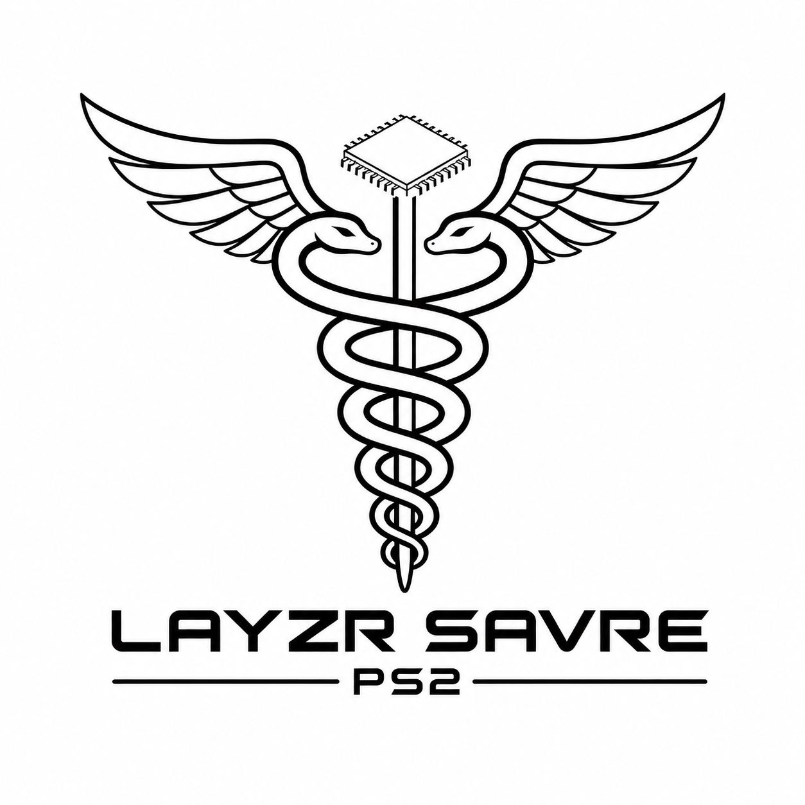

  <picture>
    <source media="(prefers-color-scheme: dark)" srcset="Images/Logos/FBD-PS2-LayzrSavre-Logo-Dark.png">
    <source media="(prefers-color-scheme: light)" srcset="Images/Logos/FBD-PS2-LayzrSavre-Logo-Light.png">
    
  </picture>

# PS2 Layzr Savre

**PS2 Layzr Savre** is an experimental PlayStation 2 optical-drive telemetry, monitoring, and future protection project.

The goal of this project is to study and monitor the PS2 optical-drive system so the console's original disc-reading function can be preserved where possible.

Layzr Savre is being developed as a hardware, firmware, and kit-development project for the PS2 community.

---

## Project Status

**Current Status:** Early research / planning / prototype development

Layzr Savre is not a finished product and should not be treated as a guaranteed laser-protection device.

This repository is currently a public project claim and announcement page.

Technical details, hardware files, firmware, schematics, and implementation documentation are not yet publicly available.

---

## Main Goal

The main goal of Layzr Savre is to help preserve the PS2's original ability to read discs.

This project is not intended to replace the optical drive with an ODE-style solution.

It is intended to study, monitor, log, and eventually help protect the original optical-drive hardware so PS2 consoles can continue reading original discs as they were designed to do.

---

## What Layzr Savre Is Not

Layzr Savre is not currently:

- A finished product.
- A public release kit.
- A guaranteed laser-protection device.
- A universal PS2 repair solution.
- A replacement for proper laser calibration.
- A replacement for optical-drive cleaning or maintenance.
- A beginner-friendly install.
- An official Sony product.
- A proven protection system.

This project is experimental and should be treated carefully.

---

## Why This Project Exists

The PlayStation 2 optical-drive system is valuable, complex, aging, and not fully documented from a modern preservation point of view.

Modern loading methods such as HDD, SMB, UDPBD, MX4SIO, MMCE, and other homebrew solutions are useful, but they do not preserve the original disc-reading function.

Layzr Savre is being developed to support that preservation goal.

---

## Announcements

Project announcements will be made here as development progresses.

No hardware, firmware, schematics, or kit materials are currently available for public distribution.

---

## License

This project is currently license pending / all rights reserved.

At this stage, no permission is granted to manufacture, sell, clone, repackage, or commercially distribute Layzr Savre hardware, firmware, software, documentation, or kit materials.

See `LICENSE.md` for the current license status.

---

## Trademark Notice

PlayStation, PlayStation 2, PS2, and related names are trademarks of their respective owners.

Layzr Savre is an independent preservation and hardware research project.

This project is not affiliated with, endorsed by, sponsored by, or approved by Sony Interactive Entertainment or any related company.

---

## AI Assistance and Attribution Disclaimer

This project uses AI tools to help with writing, organization, documentation, research, code examples, and design planning. While I review and edit the information, some details may still be incorrect, incomplete, or outdated.

Not all ideas, code, research, methods, or technical information in this project should be credited only to me. This project may reference, build on, or be inspired by community knowledge, open-source projects, datasheets, forum posts, Discord discussions, manufacturer documentation, and the work of other developers and modders.

Credit will be given whenever a source is known. If something is missing credit or needs correction, please let me know so I can update the documentation.
